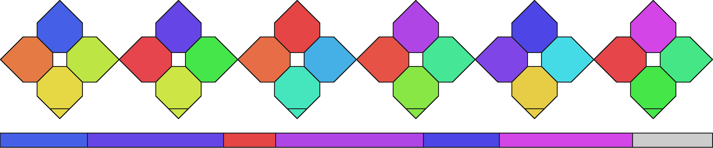

# Moleco

Moleco stands for **mole**cule to **co**lor. It generates unique color swatch for given substance based on its InChI notation. It can also generate color identification for mixture using MInChI notation.

## How to run

`moleco generate "InChI=1S/C8H10N4O2/c1-10-4-9-6-5(10)7(13)12(3)8(14)11(6)2/h4H,1-3H3" --print`

That will generate a color swatch for caffeine.


## Installation

TODO

## Support for mixtures

Of course in nature there is much more likely to see mixtures instead of single substances, so MInChI is supported as well. You can generate **toothpaste**:

```
moleco generate "MInChI=0.00.1S/C12H26O4S.Na/c1-2-3-4-5-6-7-8-9-10-11-12-16-17(13,14)15;/h2-12H2,1H3,(H,13,14,15);/q;+1/p-1&C3H8O3/c4-1-3(6)2-5/h3-6H,1-2H2&C7H5NO3S.Na/c9-7-5-3-1-2-4-6(5)12(10,11)8-7;/h1-4H,(H,8,9);/q;+1/p-1&Ca.H3O4P.2H2O/c;1-5(2,3)4;;/h;(H3,1,2,3,4);2*1H2/q+2;;;/p-2&FH2O3P.2Na/c1-5(2,3)4;;/h(H2,2,3,4);;/q;2*+1/p-2&H2O/h1H2/n{6&2&&5&3&4&1}/g{215wf-3&25wf-2&1wf-2&8wf-3&2wf-3&5wf-1&15wf-3}" --print
```



or **dishwashing liquid**:
```
moleco generate "MInChI=0.00.1S/C12H26O4S.Na/c1-2-3-4-5-6-7-8-9-10-11-12-16-17(13,14)15;/h2-12H2,1H3,(H,13,14,15);/q;+1/p-1&C18H30O3S.Na/c1-2-3-4-5-6-7-8-9-10-11-12-17-13-15-18(16-14-17)22(19,20)21;/h13-16H,2-12H2,1H3,(H,19,20,21);/q;+1/p-1&ClH.Na/h1H;/q;+1/p-1&H2O/h1H2/n{4&{2&4}&&{1&4}&3}/g{807wf-3&{6pp1&4pp1}117wf-3&1wf-2&{27pp0&73pp0}66wf-3&}" --print
```


or solution of **9-Borabicyclo[3.3.1]nonane in undefined amounts of hexanes**:

```
moleco generate "MInChI=0.00.1S/C6H12/c1-6-4-2-3-5-6/h6H,2-5H2,1H3&C6H14/c1-3-5-6-4-2/h3-6H2,1-2H3&C6H14/c1-4-5-6(2)3/h6H,4-5H2,1-3H3&C6H14/c1-4-6(3)5-2/h6H,4-5H2,1-3H3&C8H15B/c1-3-7-5-2-6-8(4-1)9-7/h7-9H,1-6H2/n{5&{2&3&4&1}}/g{4mr-1&{&&&}}" --print
```


or, if you are fan, you can generate **bechamel sauce**:
```
moleco generate "MInChI=0.00.1S/C12H17N4OS.ClH/c1-8-11(3-4-17)18-7-16(8)6-10-5-14-9(2)15-12(10)13;/h5,7,17H,3-4,6H2,1-2H3,(H2,13,14,15);1H/q+1;/p-1&C17H20N4O6/c1-7-3-9-10(4-8(7)2)21(5-11(23)14(25)12(24)6-22)15-13(18-9)16(26)20-17(27)19-15/h3-4,11-12,14,22-25H,5-6H2,1-2H3,(H,20,26,27)/t11-,12+,14-/m0/s1&C19H19N7O6/c20-19-25-15-14(17(30)26-19)23-11(8-22-15)7-21-10-3-1-9(2-4-10)16(29)24-12(18(31)32)5-6-13(27)28/h1-4,8,12,21H,5-7H2,(H,24,29)(H,27,28)(H,31,32)(H3,20,22,25,26,30)/t12-/m0/s1&C20H30O/c1-16(8-6-9-17(2)13-15-21)11-12-19-18(3)10-7-14-20(19,4)5/h6,8-9,11-13,21H,7,10,14-15H2,1-5H3/b9-6+,12-11+,16-8+,17-13+&C27H44O/c1-19(2)8-6-9-21(4)25-15-16-26-22(10-7-17-27(25,26)5)12-13-23-18-24(28)14-11-20(23)3/h12-13,19,21,24-26,28H,3,6-11,14-18H2,1-2,4-5H3/b22-12+,23-13-/t21-,24+,25-,26+,27-/m1/s1&C27H46O/c1-18(2)7-6-8-19(3)23-11-12-24-22-10-9-20-17-21(28)13-15-26(20,4)25(22)14-16-27(23,24)5/h9,18-19,21-25,28H,6-8,10-17H2,1-5H3/t19-,21+,22+,23-,24+,25+,26+,27-/m1/s1&C6H5NO2/c8-6(9)5-2-1-3-7-4-5/h1-4H,(H,8,9)&C8H10NO6P/c1-5-8(11)7(3-10)6(2-9-5)4-15-16(12,13)14/h2-3,11H,4H2,1H3,(H2,12,13,14)&C9H17NO5/c1-9(2,5-11)7(14)8(15)10-4-3-6(12)13/h7,11,14H,3-5H2,1-2H3,(H,10,15)(H,12,13)/t7-/m0/s1&Ca/q+2&Na/q+1/n{{{{&}&6&11&&4}&{{&}&&&1&2&7&9&8&3&}}&{{&}&6&11&&&4&5&10}}/g{{{{56wf-2&25wf-3}8wf-1&3wf-3&1wf-2&125wf-4&}466wf-3&{{56wf-4&168wf-3}725wf-3&187wf-4&137wf-3&447wf-8&215wf-8&6365wf-8&1008wf-8&341wf-8&49wf-8&9wf-3}534wf-3}1pp1&{{6wv-1&2wv-2}2wv-2&8wv-5&48wv-5&48wv-3&36wv-3&&&}9pp1}" --print
```


## Motivation

TODO

## How mixture bar sizes are calculated

TODO

## Questions

### Are there collisions?

TODO

### Why no support for InChIKey?

TODO

### Why the shape?

TODO

### How to recognize the substance?

It may be challenging to recognize the substance based on the color swatch after some time, so be sure to keep the InChI notation somewhere close if you are using just the swatch. If you have original image file though - original substance will be saved in EXIF metadata.

## References

### IhChI and MInChI

  * https://jcheminf.biomedcentral.com/articles/10.1186/s13321-015-0068-4
  * https://jcheminf.biomedcentral.com/articles/10.1186/s13321-019-0357-4
  * http://molmatinf.com/minchidemo/
  * https://github.com/IUPAC/MInChI_demo

### Color spaces

  * https://paletton.com/
  * https://ericportis.com/posts/2024/okay-color-spaces/

### PubChem resources
  * https://pubchem.ncbi.nlm.nih.gov/
  * https://pubchem.ncbi.nlm.nih.gov/docs/compound-vs-substance

